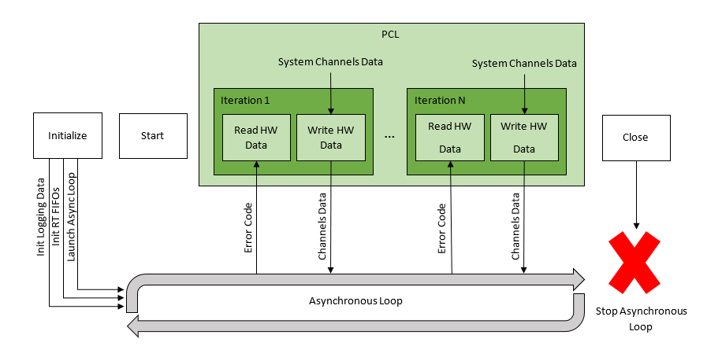
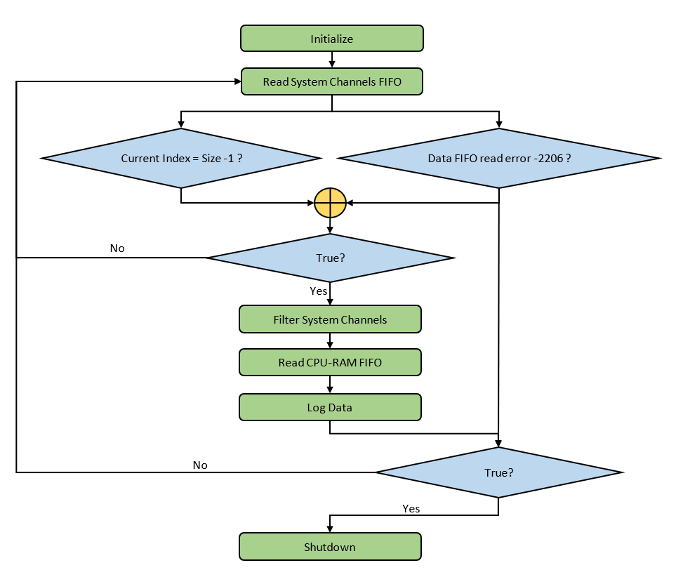

# General Details

The NI VeriStand Telemetry Custom Device is an [Inline Hardware Interface Custom Device](http://zone.ni.com/reference/en-XX/help/372846M-01/veristandmerge/inline_hw_cds/), which allows it to read and write data to and from other parts of NI VeriStand in each iteration of the PCL. However, to avoid causing latency in the PCL that is associated with file I/O, the Telemetry Custom Device launches an asynchronous loop to log the data to a file.

The following topics detail how this custom device uses an asynchronous loop and RT FIFOs, as well as where you can locate the code in the device that performs each task.

# RT DRIVER

The following diagram illustrates how the Telemetry Custom Device uses an asynchronous loop to execute with respect to the PCL and how the Telemetry communicates to the asynchronous loop via RT FIFOs.

To view the RT Driver VI code open the VI from the "Engine\RT Driver VI.vi".

## Initialize

The Initialize case of the Telemetry RT Driver VI creates three RT FIFOs and launches an asynchronous loop. The Data RT FIFO communicates channel data from the Telemetry RT Driver VI to the asynchronous loop. The Status RT FIFO communicates state information from the asynchronous loop to the Telemetry RT Driver VI. The Async Closed RT FIFO is used to communicate when the asynchronous loop finished execution in the Close case.

To view the code for the asynchronous loop, open the Async Logger VI from the "Engine\Run\Async Logger.vi".

## Start

No Telemetry specific code executes in this case.

## Read Data from HW

As previously mentioned, one of the RT FIFOs created in the Initialize case passes status information from the asynchronous loop to the Telemetry RT Driver VI. The reading of this RT FIFO takes place in the Read Data from HW case. In this case, the Telemetry checks the RT FIFO for an error code. If an error code, or timeout is reported, the error code is written in the Error Code channel.

## Write Data to HW

In the Write Data to HW case, for each PCL iteration, the VeriStand System Channels Data for all the VeriStand system channels is sent from the Inline Custom Device to the asynchronous loop, using the Data FIFO.

## Close

During the Close case of the RT Driver VI, we allow a delay for the asynchronous loop to read all the values from the Data FIFO, after which we Delete both Data and Status FIFOs. This will trigger the shutdown phase for the asynchronous loop. If we receive the Async Close acknowledge, or the maximum defined time is reached, the Async Closed FIFO is deleted also.

# Asynchronous Loop

The asynchronous loop, Async Logger VI, is a VI that runs asynchronous to the PCL Loop. It contains a while loop for Data Processing and Logging, and a timed loop used for reading the CPU and RAM usage data.

The Timed Loop will continually read and update the CPU-RAM FIFO with CPU and RAM usage data with a period of 400 milliseconds for RT Targets, and 2 seconds for Windows ones. The size of this FIFO is 1, this means that we keep only the latest value inside this RT FIFO.

To view the code used to launch the Async Logger, open the Initialize Logger VI from the "Engine\Init\Initialize Logger.vi". Inside this VI you can notice the default data for the Logger parameters. The Buffers.Size is a dynamic value that is calculated depending on the Engine Rate. For a Windows Target it will be twice the Engine Rate, in order to write the Buffers.LOG Data array each 2 seconds, as to be in sync with the CPU and RAM timed loop reading. For RT Targets it is half the Engine Rate, in order to write the Buffers.LOG Data close to the 400 ms timed loop update of the CPU-RAM usage update rate.

The following diagram shows the states of the Data Processing and Logging Loop as this is the main execution loop for this VI.

## Initialize

The Initialize case of the Async Logger will open a TDMS reference to the log file and set the properties for all the expected channels and channel groups, as well as initializing the buffers needed for the logged data.

## Read System Channels FIFO

The Read System Channels FIFO case of the Async Logger is reading all the System Channels data for one PCL Loop that is sent from the Write Data to HW case. This data is buffered in the Buffers.All System Channels Data array. If the buffer array is full we go to Filter System Channels. If the RT Data FIFO was deleted, we go to Filter System Channels Data and enable is Shutdown boolean.

## Filter System Channels

In the Filter System Channels case of the Async Logger we take only the VeryStand System Channels data for the expected channels, and we copy that data to the Buffers.LOG Data array. After this case executes, we execute Read CPU-RAM FIFO case.

## Read CPU-RAM FIFO

In the Read CPU-RAM FIFO case of the Async Logger, the values read from the CPU-RAM RT FIFO are added to the Buffers.LOG Data array.

## Log Data

In the Log Data case of the Async Logger, the Buffers.LOG Data array is written to the TDMS Log File, and the Buffers.Current Index is reset to 0. If is Shutdown boolean is true, then we go to the Shutdown case, if not, we go to Read System Channels Case.

## Shutdown

In the Shutdown case, we close the TDMS file reference and stop the Data Processing and Logging Loop.